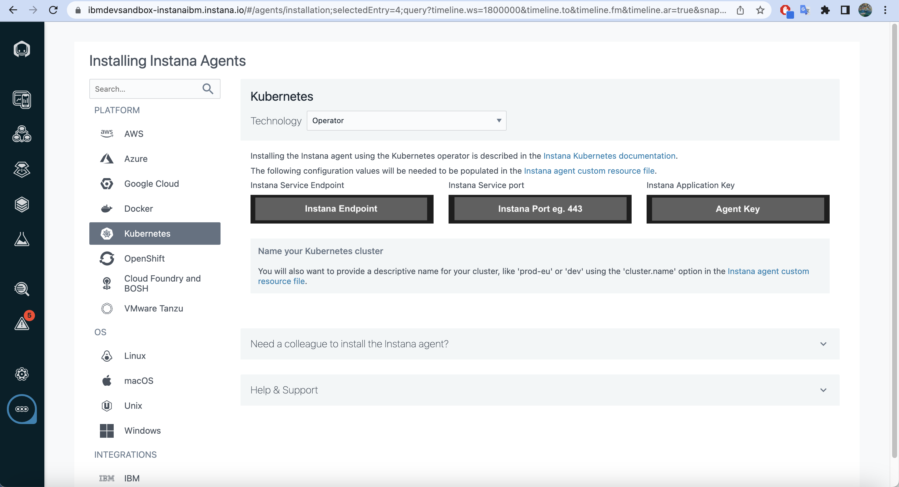

# IBM® Instana® Addon for Amazon EKS Blueprint

The IBM® Instana® Addon for Amazon EKS Blueprint is designed to enhance observability, monitoring, and management capabilities for applications running on Amazon Elastic Kubernetes Service (EKS). IBM Instana collects data from monitored systems by using a single agent on each host. The agent runs on your hosts to collect and aggregate data from various sensors before it sends the data to the Instana backend.

The IBM® Instana® [Addon](https://www.npmjs.com/package/%40instana/aws-eks-blueprint-addon) focuses on enhancing the user experience by reducing the complexity and time required to install and configure an Instana host agent on Amazon EKS cluster. Once you configure the addon for a Amazon EKS blueprint, it will be automatically provisioned during deployment.

This Addon will use IBM Instana Kubernetes operator in the namespace ```instana-agent``` to install and manage the Instana agent. It also configures custom resource values to configure the operator.

## Prerequisites

Ensure that you have installed the following tools on your machine.

1. [aws cli](https://docs.aws.amazon.com/cli/latest/userguide/install-cliv2.html)
2. [kubectl](https://Kubernetes.io/docs/tasks/tools/)
3. [cdk](https://docs.aws.amazon.com/cdk/v2/guide/getting_started.html#getting_started_install)
4. [npm](https://docs.npmjs.com/cli/v8/commands/npm-install)
5. Instana backend application - Use SaaS (eg [aws](https://aws.amazon.com/marketplace/pp/prodview-hnqy5e3t3fzda?sr=0-1&ref_=beagle&applicationId=AWSMPContessa)) or Install self-hosted Instana backend ([on-premises](https://www.ibm.com/docs/en/instana-observability/current?topic=installing-configuring-self-hosted-instana-backend-premises))

## Installation

To create a new project and install dependencies, follow these steps from Amazon EKS Blueprint [Quick Start](https://aws-quickstart.github.io/cdk-eks-blueprints/getting-started)

Use following command to Install IBM Instana Addon:

```shell
npm i @instana/aws-eks-blueprint-addon
```

## Instana Agent Configuration
Go to your Instana installation (Instana User Interface), click ... More > Agents > Installing Instana Agents and select 'Kubernetes' platform to get the Instana Agent Key, Instana Service Endpoint, Instana Service port. These steps are also described [here](https://www.ibm.com/docs/en/instana-observability/218?topic=instana-endpoints-keys) or in the screenshot below.



To set the following environment variables from the CLI, use the corresponding values obtained from the Instana Service Endpoint and Port (as shown in the above screenshot), and the Instana Application Key (also shown in the above screenshot):

- Set the value of **INSTANA_ENDPOINT_HOST_URL** to the Instana Service Endpoint.
- Set the value of **INSTANA_ENDPOINT_HOST_PORT** to the Instana Service Port.
- Set the value of **INSTANA_AGENT_KEY** to the Instana Application Key.

You can choose the names for **AMAZON_EKS_CLUSTER_NAME** and **INSTANA_ZONE_NAME** based on your cluster's name, for example, "eks-blueprint".

Set the value of the following environment variable and run it on CLI to set those variables.

```
export INSTANA_ZONE_NAME=
export AMAZON_EKS_CLUSTER_NAME=
export INSTANA_AGENT_KEY=
export INSTANA_ENDPOINT_HOST_URL=
export INSTANA_ENDPOINT_HOST_PORT=
```

For example:

```
export INSTANA_ZONE_NAME=eks-blueprint
export AMAZON_EKS_CLUSTER_NAME=eks-blueprint
export INSTANA_AGENT_KEY=abc123
export INSTANA_ENDPOINT_HOST_URL=instana.example.com
export INSTANA_ENDPOINT_HOST_PORT="443"
```

## Usage
```typescript
import * as blueprints from "@aws-quickstart/eks-blueprints";
import { loadYaml } from "@aws-quickstart/eks-blueprints/dist/utils";
import * as cdk from "aws-cdk-lib";
import { InstanaOperatorAddon } from "@instana/aws-eks-blueprint-addon";

const instanaProps = {
  zone: {
    name: process.env.INSTANA_ZONE_NAME, // Mandatory Parameter
  },
  cluster: {
    name: process.env.AMAZON_EKS_CLUSTER_NAME, // Mandatory Parameter
  },
  agent: {
    key: process.env.INSTANA_AGENT_KEY,// Mandatory Parameter
    endpointHost: process.env.INSTANA_ENDPOINT_HOST_URL,// Mandatory Parameter
    endpointPort: process.env.INSTANA_ENDPOINT_HOST_PORT, // Mandatory Parameter
    env: {
    },
  },
};
const yamlObject = loadYaml(JSON.stringify(instanaProps));

export default class InstanaConstruct {
  async buildAsync(scope: cdk.App) {
    try {
      checkInstanaProps(instanaProps); // Call the function to check prop values

      const stackID = yamlObject.cluster.name!;

      const addOns: Array<blueprints.ClusterAddOn> = [
        new InstanaOperatorAddon(yamlObject),
      ];

      blueprints.EksBlueprint.builder()
        .account(process.env.CDK_DEFAULT_ACCOUNT!)
        .region(process.env.CDK_DEFAULT_REGION!)
        .addOns(...addOns)
        .name(stackID)
        .build(scope, stackID);

      console.log("Blueprint built successfully.");
    } catch (error) {
      console.error("Error:", error);
      throw new Error(`environment variables must be setup for the instana-operator pattern to work`);
    }
  }
}

function checkInstanaProps(instanaProps: any) {
  function checkPropValue(propName: string, propValue: any) {
    if (propValue === undefined || propValue === null || propValue === "") {
      throw new Error(`Missing or empty value for property '${propName}'.`);
    }
  }

  // Check zone
  checkPropValue("zone.name", instanaProps.zone.name);

  // Check cluster
  checkPropValue("cluster.name", instanaProps.cluster.name);

  // Check agent
  checkPropValue("agent.key", instanaProps.agent.key);
  checkPropValue("agent.endpointHost", instanaProps.agent.endpointHost);
  checkPropValue("agent.endpointPort", instanaProps.agent.endpointPort);
}
```

## AddOn Configuration Options
| Option                  | Description                                         | Default                       |
|-------------------------|-----------------------------------------------------|-------------------------------|
| `agent.endpointHost`                | Instana Agent backend endpoint host                                | https://ingress-red-saas.instana.io/ (US and ROW)                            |
| `agent.endpointPort`                | Instana Agent backend endpoint port                                | "443"                            |
| `agent.key`  | Your Instana Agent key             | nil                            |
| `agent.downloadKey`  | Your Instana Download key             | nil                            |
| `agent.env`       | Additional environment variables for the agent    | {}                            |
| `agent.configuration_yaml`       | Custom content for the agent configuration.yaml file    | nil                            |
| `cluster.name`             | Display name of the monitored cluster    | "Value of zone.name"                     |
| `zone.name`               | Zone that detected technologies will be assigned to               | nil                     |

## Bootstraping
Bootstrap your environment with the following command.

```shell
cdk bootstrap
```

and finally you can deploy the stack with the following command.
```shell
cdk deploy
```

## Verify the resources
Run update-kubeconfig command. You should be able to get the command from CDK output message. More information can be found [here](https://aws-quickstart.github.io/cdk-eks-blueprints/getting-started/#cluster-access).

```console
aws eks update-kubeconfig --name <your cluster name> --region <your region> --role-arn arn:aws:iam::xxxxxxxxx:role/eks-blue1-eksblue1AccessRole32C5DF05-1NBFCH8INI08A
```

## Testing
To validate if Instana Agent configured properly in Amazon EKS. You can run the following command after Amazon EKS cluster in deployed and running.
```shell
kubectl get pods -n instana-agent
```
Output of the above command will be silimar to below one:

```output
NAMESPACE       NAME                                  				READY   	STATUS    RESTARTS   AGE
instana-agent   controller-manager-78479cb596-sktg9   	1/1     	Running   					0          56m
instana-agent   controller-manager-78479cb596-xz8kn   	1/1     	Running   					0          56m
instana-agent   instana-agent-gsqx8                   				1/1     	Running   					0          56m
```

Run following command to verify Instana Agent logs
```shell
kubectl logs <instana-agent-pod-name> -n instana-agent # Output shows instana agent logs. pod name in this example is instana-agent-gsqx8
```

Once you see Instana Agent is running in your Amazon EKS Cluster, you can go to Instana Installation (User Interface) to get the APM metrices.


## Cleanup

To clean up your EKS Blueprints, run the following commands:

```sh
cdk destroy
```

## Disclaimer 
This pattern relies on an open source NPM package eks-blueprints-cdk-kubeflow-ext. Please refer to the package npm site for more information.
```
https://www.npmjs.com/package/@instana/aws-eks-blueprint-addon'
```